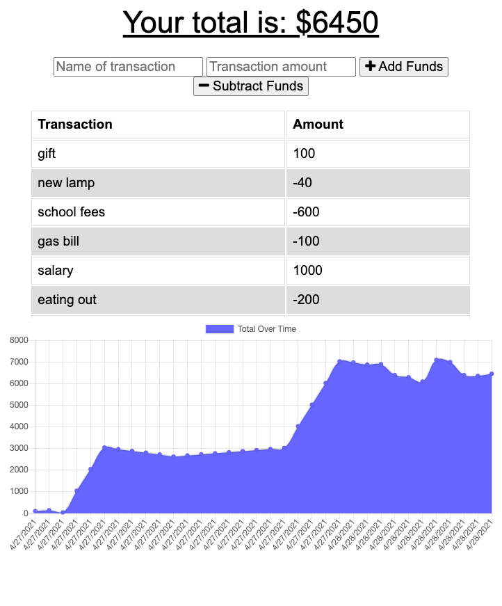

# PWA Budget Tracker
a budget tracker with offline and online capability

## Description
The app allows users to be able to add expenses and deposits to their budget with or without a connection. When app comes back online, offline transactions will be added to the total.

## User Story

AS AN avid traveller
I WANT to be able to track my withdrawals and deposits with or without a data/internet connection
SO THAT my account balance is accurate when I am traveling

## Business Context

Giving users a fast and easy way to track their money is important, but allowing them to access that information anytime is even more important. Having offline functionality is paramount to our applications success.

## Table of Contents

* [Installation](#installation)
* [Usage](#usage)
* [Contributing Guidelines](#contributing)
* [License](#license)
* [Questions](#questions)

## Installation

This app makes use of the following technologies:
1. service-worker

2. indexedDB

3. manifest.webmanifest

4. Mongoose

5. Express

[Click here to view the deployed app](https://budget-tracker14.herokuapp.com/)

Alternatively, the repo can be downloaded and run locally. All the npm packages are provided in the package.json file and running npm i from the command line will install them all. After that just run 'npm start' to start app.

## Usage

When the user opens to app, they are given the option to add or subtract funds from their budget. When a transaction is entered, the aomunt is added or subtracted from the total budget displayed at the top as well as being plotted on the chart. The transaction amount with the name of the transaction is displayed as well.

When the app goes offline, the user is still able to add or subtract funds and the chart will still update with the new values. When the app goes back online, the offline trasactions will be added to the database and deleted from the local indexedDB storage.

## Contributing

 

 Link to Contributor's Covenant:[Contributors Covenant](https://www.contributor-covenant.org/version/2/0/code_of_conduct/) 

 
## License

   
Copyright (c) [2021] [Nida Ghuman]

Permission is hereby granted, free of charge, to any person obtaining a copy
of this software and associated documentation files (the "Software"), to deal
in the Software without restriction, including without limitation the rights
to use, copy, modify, merge, publish, distribute, sublicense, and/or sell
copies of the Software, and to permit persons to whom the Software is
furnished to do so, subject to the following conditions:

The above copyright notice and this permission notice shall be included in all
copies or substantial portions of the Software.

THE SOFTWARE IS PROVIDED "AS IS", WITHOUT WARRANTY OF ANY KIND, EXPRESS OR
IMPLIED, INCLUDING BUT NOT LIMITED TO THE WARRANTIES OF MERCHANTABILITY,
FITNESS FOR A PARTICULAR PURPOSE AND NONINFRINGEMENT. IN NO EVENT SHALL THE
AUTHORS OR COPYRIGHT HOLDERS BE LIABLE FOR ANY CLAIM, DAMAGES OR OTHER
LIABILITY, WHETHER IN AN ACTION OF CONTRACT, TORT OR OTHERWISE, ARISING FROM,
OUT OF OR IN CONNECTION WITH THE SOFTWARE OR THE USE OR OTHER DEALINGS IN THE
SOFTWARE. 

## Questions

The repo for this project can be found here: https://github.com/nidaqg/PWA-budget-tracker

Heroku link for deployed project can be found at: https://budget-tracker14.herokuapp.com/

For any questions or to report issues, email me at: nidaqg@gmail.com

